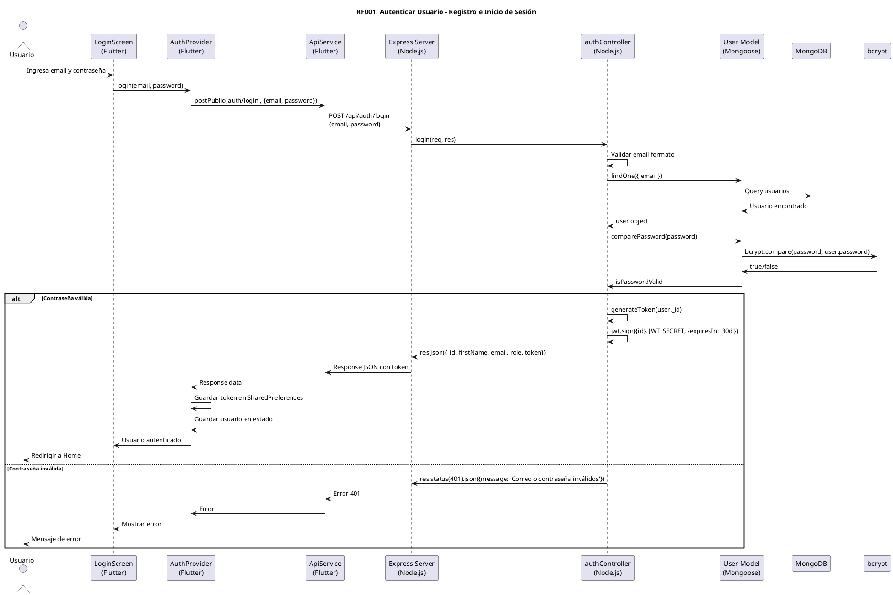
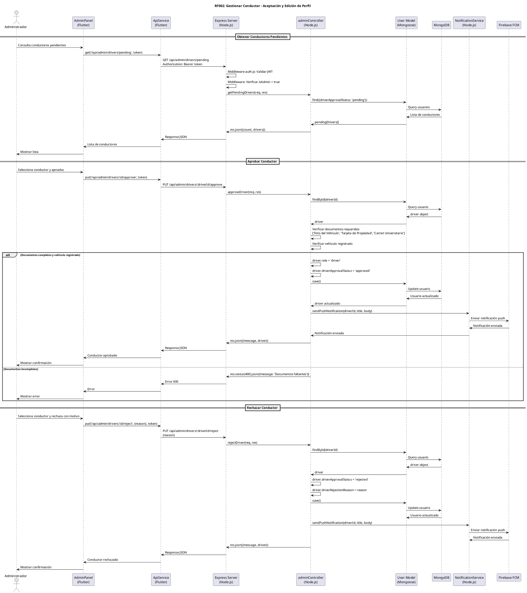
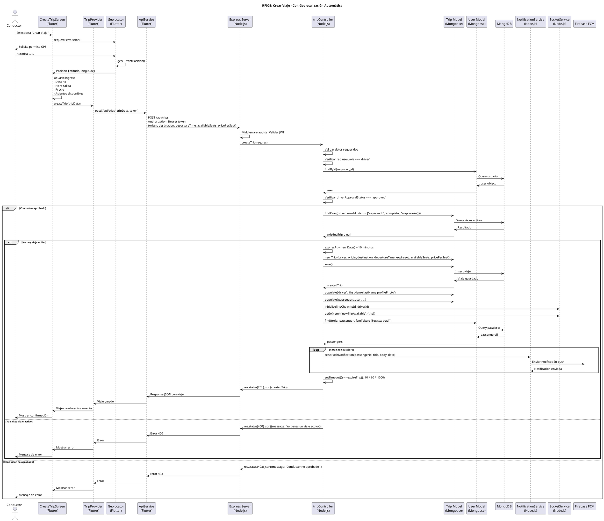
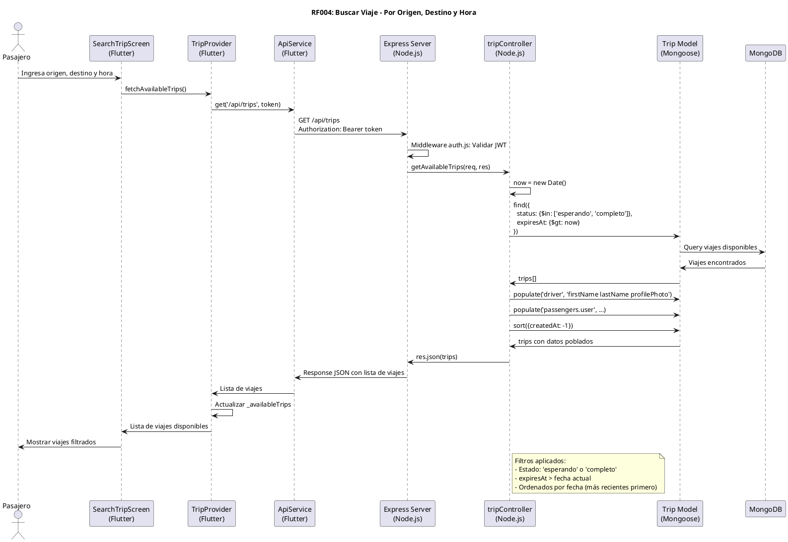
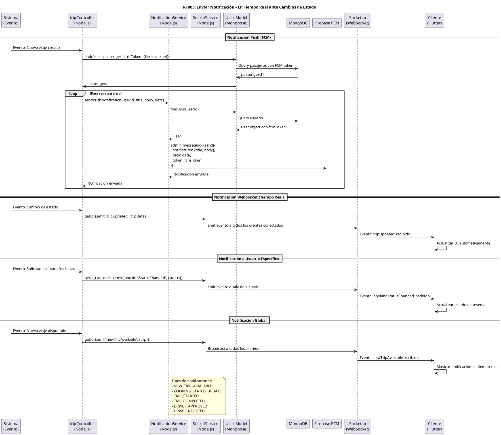
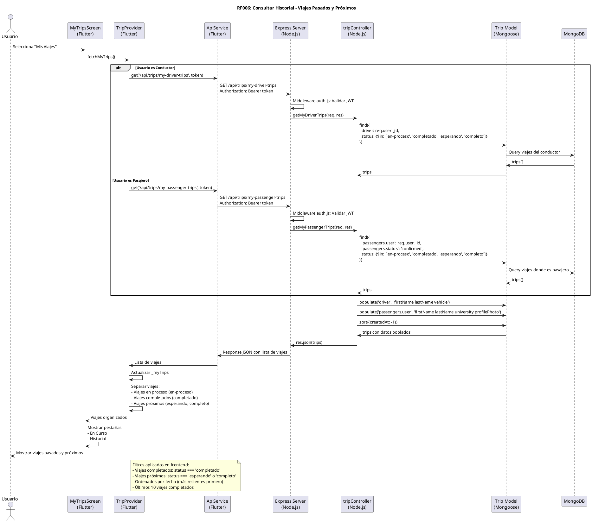
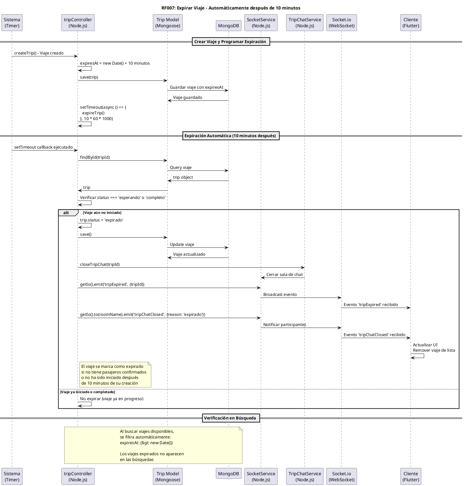
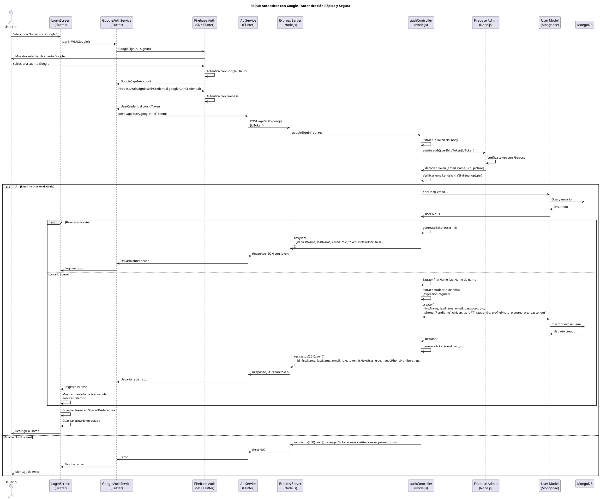

# Diagramas de Secuencia UML - Sistema RideUPT

## Requerimientos Funcionales

### RF001: Autenticar Usuario

### RF002: Gestionar Conductor

### RF003: Crear Viaje

### RF004: Buscar Viaje

### RF005: Enviar Notificación

### RF006: Consultar Historial

### RF007: Expirar Viaje

### RF008: Autenticar con Google

---

## Resumen de Diagramas

Los diagramas de secuencia anteriores representan el flujo completo de los 8 requerimientos funcionales según la implementación real del código:

1. **RF001 - Autenticar Usuario**: Flujo completo de login con validación de credenciales y generación de JWT
2. **RF002 - Gestionar Conductor**: Proceso de aprobación/rechazo de conductores por administradores
3. **RF003 - Crear Viaje**: Creación de viaje con geolocalización automática, validaciones y notificaciones
4. **RF004 - Buscar Viaje**: Búsqueda de viajes disponibles con filtros de estado y expiración
5. **RF005 - Enviar Notificación**: Sistema dual de notificaciones (FCM push + WebSocket tiempo real)
6. **RF006 - Consultar Historial**: Consulta de viajes propios separados por estado
7. **RF007 - Expirar Viaje**: Expiración automática mediante setTimeout programado
8. **RF008 - Autenticar con Google**: Flujo completo de OAuth con Firebase y validación de email institucional

Todos los diagramas están basados en el código real del proyecto y reflejan la arquitectura cliente-servidor con Flutter, Node.js, MongoDB y Firebase.

