# Diagrama de Clases UML - Sistema RideUPT

## Diagrama de Clases Completo

```plantuml
@startuml Diagrama_Clases_RideUPT
title Diagrama de Clases UML - Sistema RideUPT

skinparam classAttributeIconSize 0
skinparam packageStyle rectangle

package "Backend (Node.js)" {
  
  package "Models (Mongoose)" {
    
    class User {
      - _id: ObjectId
      - firstName: String
      - lastName: String
      - email: String {unique}
      - password: String
      - phone: String
      - university: String
      - studentId: String
      - age: Number
      - gender: Enum ['masculino', 'femenino', 'otro', 'prefiero_no_decir']
      - bio: String
      - role: Enum ['passenger', 'driver']
      - isAdmin: Boolean
      - profilePhoto: String
      - isDriverProfileComplete: Boolean
      - driverApprovalStatus: Enum ['pending', 'approved', 'rejected']
      - driverRejectionReason: String
      - vehicle: Vehicle
      - driverDocuments: DriverDocument[]
      - fcmToken: String
      - averageRating: Number
      - totalRatings: Number
      - createdAt: Date
      - updatedAt: Date
      --
      + comparePassword(enteredPassword): Promise<Boolean>
      + save(): Promise<User>
    }
    
    class Vehicle {
      - make: String
      - model: String
      - year: Number
      - color: String
      - licensePlate: String {unique, sparse}
      - totalSeats: Number [1..8]
    }
    
    class DriverDocument {
      - tipoDocumento: Enum ['Foto del Vehículo', 'Tarjeta de Propiedad', 'Carnet Universitario', 'Selfie del Conductor']
      - urlImagen: String
      - subidoEn: Date
    }
    
    class Trip {
      - _id: ObjectId
      - driver: ObjectId {ref: User}
      - origin: Point
      - destination: Point
      - departureTime: Date
      - expiresAt: Date
      - availableSeats: Number
      - seatsBooked: Number
      - pricePerSeat: Number
      - description: String
      - status: Enum ['esperando', 'completo', 'en-proceso', 'completado', 'expirado', 'cancelado']
      - passengers: Passenger[]
      - createdAt: Date
      - updatedAt: Date
      --
      + save(): Promise<Trip>
      + populate(path): Promise<Trip>
    }
    
    class Point {
      - type: Enum ['Point']
      - coordinates: Number[] [longitude, latitude]
      - name: String
    }
    
    class Passenger {
      - user: ObjectId {ref: User}
      - status: Enum ['pending', 'confirmed', 'rejected', 'cancelled']
      - bookedAt: Date
      - inVehicle: Boolean
    }
    
    class Rating {
      - _id: ObjectId
      - rater: ObjectId {ref: User}
      - rated: ObjectId {ref: User}
      - trip: ObjectId {ref: Trip}
      - rating: Number [1..5]
      - comment: String
      - ratingType: Enum ['driver', 'passenger']
      - createdAt: Date
      - updatedAt: Date
      --
      + save(): Promise<Rating>
    }
    
    User "1" *-- "0..1" Vehicle : contiene
    User "1" *-- "0..*" DriverDocument : tiene
    Trip "1" --> "1" User : conductor
    Trip "1" *-- "1" Point : origen
    Trip "1" *-- "1" Point : destino
    Trip "1" *-- "0..*" Passenger : tiene
    Passenger "1" --> "1" User : pasajero
    Rating "1" --> "1" User : calificador
    Rating "1" --> "1" User : calificado
    Rating "1" --> "1" Trip : relacionado
  }
  
  package "Controllers" {
    
    class authController {
      + register(req, res): Promise<void>
      + login(req, res): Promise<void>
      + googleSignIn(req, res): Promise<void>
      - generateToken(id): String
    }
    
    class tripController {
      + createTrip(req, res): Promise<void>
      + getAvailableTrips(req, res): Promise<void>
      + getTripById(req, res): Promise<void>
      + requestBooking(req, res): Promise<void>
      + manageBooking(req, res): Promise<void>
      + getMyDriverTrips(req, res): Promise<void>
      + getMyPassengerTrips(req, res): Promise<void>
      + startTrip(req, res): Promise<void>
      + cancelTrip(req, res): Promise<void>
      + completeTrip(req, res): Promise<void>
      + leaveTrip(req, res): Promise<void>
    }
    
    class userController {
      + updateProfile(req, res): Promise<void>
      + getProfile(req, res): Promise<void>
      + updateDriverProfile(req, res): Promise<void>
      + uploadDriverDocument(req, res): Promise<void>
    }
    
    class adminController {
      + getPendingDrivers(req, res): Promise<void>
      + getAllDrivers(req, res): Promise<void>
      + approveDriver(req, res): Promise<void>
      + rejectDriver(req, res): Promise<void>
      + getDriverDetails(req, res): Promise<void>
      + getAllUsers(req, res): Promise<void>
      + getUserRankings(req, res): Promise<void>
      + getSystemStats(req, res): Promise<void>
    }
    
    class ratingController {
      + createRating(req, res): Promise<void>
      + getRatingsForUser(req, res): Promise<void>
      + getRatingForTrip(req, res): Promise<void>
    }
    
    authController ..> User : usa
    tripController ..> Trip : usa
    tripController ..> User : usa
    tripController ..> notificationService : usa
    tripController ..> socketService : usa
    userController ..> User : usa
    adminController ..> User : usa
    adminController ..> notificationService : usa
    ratingController ..> Rating : usa
    ratingController ..> User : usa
    ratingController ..> Trip : usa
  }
  
  package "Services" {
    
    class notificationService {
      + initializeFCM(): void
      + sendPushNotification(userId, title, body, data): Promise<void>
    }
    
    class socketService {
      + initializeSocket(ioInstance): void
      + getIo(): SocketIOServer
      + authenticateSocket(socket, next): Promise<void>
    }
    
    class tripChatService {
      + initializeTripChat(tripId, driverId): void
      + closeTripChat(tripId): void
      + addParticipant(tripId, userId): void
      + removeParticipant(tripId, userId): void
      + sendMessage(tripId, userId, message): void
      + getChatHistory(tripId): Message[]
      + isChatActive(tripId): Boolean
    }
    
    notificationService ..> User : usa
    socketService ..> User : usa
    tripChatService ..> Trip : usa
  }
}

package "Frontend (Flutter/Dart)" {
  
  package "Models" {
    
    class User_Dart {
      - id: String
      - firstName: String
      - lastName: String
      - email: String
      - role: String
      - isAdmin: Boolean
      - phone: String
      - university: String
      - studentId: String
      - profilePhoto: String
      - age: int?
      - gender: String?
      - bio: String?
      - vehicle: Vehicle_Dart?
      - driverDocuments: List<DriverDocument_Dart>
      - averageRating: double
      - totalRatings: int
      - driverApprovalStatus: String?
      - driverRejectionReason: String?
      --
      + fullName: String {get}
      + initials: String {get}
      + isDriver: Boolean {get}
      + isPassenger: Boolean {get}
      + isDriverApproved: Boolean {get}
      + isDriverPending: Boolean {get}
      + isProfileComplete: Boolean {get}
      + averageRatingText: String {get}
      + fromJson(json): User_Dart
      + toJson(): Map<String, dynamic>
      + copyWith(...): User_Dart
    }
    
    class Vehicle_Dart {
      - make: String
      - model: String
      - year: int
      - color: String
      - licensePlate: String
      - totalSeats: int
      --
      + fromJson(json): Vehicle_Dart
      + toJson(): Map<String, dynamic>
    }
    
    class DriverDocument_Dart {
      - tipoDocumento: String
      - urlImagen: String?
      - subidoEn: DateTime
      --
      + isUploaded: Boolean {get}
      + fromJson(json): DriverDocument_Dart
      + toJson(): Map<String, dynamic>
    }
    
    class Trip_Dart {
      - id: String
      - driver: User_Dart
      - origin: LocationPoint
      - destination: LocationPoint
      - departureTime: DateTime
      - expiresAt: DateTime?
      - availableSeats: int
      - seatsBooked: int
      - pricePerSeat: double
      - description: String?
      - status: String
      - passengers: List<TripPassenger>
      --
      + hasTimeExpired: Boolean {get}
      + minutesRemaining: int {get}
      + timeRemainingText: String {get}
      + isInProgress: Boolean {get}
      + isCompleted: Boolean {get}
      + isActive: Boolean {get}
      + isFull: Boolean {get}
      + isExpired: Boolean {get}
      + isCancelled: Boolean {get}
      + acceptsRequests: Boolean {get}
      + fromJson(json): Trip_Dart
    }
    
    class LocationPoint {
      - name: String
      - coordinates: LatLng
      --
      + fromJson(json): LocationPoint
      + toJson(): Map<String, dynamic>
    }
    
    class TripPassenger {
      - user: User_Dart
      - status: String
      - bookedAt: DateTime
      - inVehicle: Boolean
      --
      + fromJson(json): TripPassenger
    }
    
    class Rating_Dart {
      - id: String
      - raterId: String
      - ratedId: String
      - tripId: String
      - rating: int
      - comment: String?
      - ratingType: String
      - createdAt: DateTime
      --
      + ratingText: String {get}
      + hasComment: Boolean {get}
      + ratingTypeText: String {get}
      + fromJson(json): Rating_Dart
      + toJson(): Map<String, dynamic>
    }
    
    User_Dart "1" *-- "0..1" Vehicle_Dart : contiene
    User_Dart "1" *-- "0..*" DriverDocument_Dart : tiene
    Trip_Dart "1" --> "1" User_Dart : conductor
    Trip_Dart "1" *-- "1" LocationPoint : origen
    Trip_Dart "1" *-- "1" LocationPoint : destino
    Trip_Dart "1" *-- "0..*" TripPassenger : tiene
    TripPassenger "1" --> "1" User_Dart : pasajero
    Rating_Dart "1" --> "1" User_Dart : calificador
    Rating_Dart "1" --> "1" User_Dart : calificado
    Rating_Dart "1" --> "1" Trip_Dart : relacionado
  }
  
  package "Providers (State Management)" {
    
    class AuthProvider {
      - _apiService: ApiService
      - _user: User_Dart?
      - _token: String?
      - _isLoading: Boolean
      - _errorMessage: String
      --
      + user: User_Dart? {get}
      + token: String? {get}
      + isAuthenticated: Boolean {get}
      + isLoading: Boolean {get}
      + errorMessage: String {get}
      + login(email, password): Future<Boolean>
      + register(userData): Future<Boolean>
      + googleSignIn(): Future<Boolean>
      + logout(): Future<void>
      + getUserProfile(): Future<void>
      - _authenticate(response): Future<Boolean>
      - _getUserProfile(): Future<void>
    }
    
    class TripProvider {
      - _apiService: ApiService
      - _authProvider: AuthProvider?
      - _availableTrips: List<Trip_Dart>
      - _myTrips: List<Trip_Dart>
      - _isLoading: Boolean
      - _errorMessage: String
      --
      + availableTrips: List<Trip_Dart> {get}
      + myTrips: List<Trip_Dart> {get}
      + activeMyTrips: List<Trip_Dart> {get}
      + completedMyTrips: List<Trip_Dart> {get}
      + isLoading: Boolean {get}
      + errorMessage: String {get}
      + fetchAvailableTrips(): Future<void>
      + fetchMyTrips(force): Future<void>
      + createTrip(tripData): Future<Trip_Dart?>
      + requestBooking(tripId): Future<Boolean>
      + getUnratedCompletedTrip(): Future<Trip_Dart?>
    }
    
    AuthProvider ..> ApiService : usa
    AuthProvider ..> User_Dart : usa
    TripProvider ..> ApiService : usa
    TripProvider ..> Trip_Dart : usa
    TripProvider ..> AuthProvider : usa
  }
  
  package "Services" {
    
    class ApiService {
      - baseUrl: String
      - _dio: Dio?
      --
      + get(endpoint, token): Future<dynamic>
      + post(endpoint, data, token): Future<dynamic>
      + put(endpoint, data, token): Future<dynamic>
      + delete(endpoint, token): Future<dynamic>
      + postPublic(endpoint, data): Future<dynamic>
      - _getHeaders(token): Map<String, String>
    }
    
    class SocketService {
      - _socket: Socket?
      - _token: String?
      - _isConnected: Boolean
      --
      + connect(token): void
      + disconnect(): void
      + isConnected: Boolean {get}
      + on(event, callback): void
      + emit(event, data): void
      + joinRoom(roomName): void
      + leaveRoom(roomName): void
    }
    
    class GoogleAuthService {
      + signInWithGoogle(): Future<UserCredential?>
      + signOut(): Future<void>
    }
    
    ApiService ..> SocketService : puede usar
    SocketService ..> ApiService : puede usar
  }
}

package "External Services" {
  
  class FirebaseAuth {
    + signInWithCredential(credential): Future<UserCredential>
    + verifyIdToken(idToken): Promise<DecodedToken>
  }
  
  class FirebaseFCM {
    + send(message): Promise<Response>
  }
  
  class MongoDB {
    + findOne(query): Promise<Document>
    + find(query): Promise<Document[]>
    + save(document): Promise<Document>
    + updateOne(query, update): Promise<void>
    + deleteOne(query): Promise<void>
  }
  
  class SocketIO {
    + emit(event, data): void
    + on(event, callback): void
    + to(room): SocketIO
  }
}

' Relaciones Backend-Frontend
User_Dart ..|> User : mapea desde
Trip_Dart ..|> Trip : mapea desde
Rating_Dart ..|> Rating : mapea desde
Vehicle_Dart ..|> Vehicle : mapea desde
DriverDocument_Dart ..|> DriverDocument : mapea desde

' Relaciones con Servicios Externos
authController ..> FirebaseAuth : usa
notificationService ..> FirebaseFCM : usa
User ..> MongoDB : persiste en
Trip ..> MongoDB : persiste en
Rating ..> MongoDB : persiste en
socketService ..> SocketIO : usa

' Relaciones API
ApiService ..> authController : comunica con
ApiService ..> tripController : comunica con
ApiService ..> userController : comunica con
ApiService ..> adminController : comunica con
ApiService ..> ratingController : comunica con

@enduml
```

## Descripción de las Clases Principales

### Backend - Models

#### User
- **Descripción**: Modelo principal de usuario del sistema. Puede ser pasajero o conductor.
- **Atributos clave**: 
  - Información personal (firstName, lastName, email, phone)
  - Rol y permisos (role, isAdmin, driverApprovalStatus)
  - Datos del conductor (vehicle, driverDocuments)
  - Calificaciones (averageRating, totalRatings)
- **Métodos**:
  - `comparePassword()`: Compara contraseña ingresada con hash almacenado
  - `save()`: Guarda o actualiza el usuario en MongoDB

#### Trip
- **Descripción**: Modelo que representa un viaje compartido.
- **Atributos clave**:
  - Ubicación (origin, destination con coordenadas geoespaciales)
  - Información del viaje (departureTime, expiresAt, pricePerSeat)
  - Estado (status: esperando, completo, en-proceso, completado, expirado, cancelado)
  - Pasajeros (passengers con estados: pending, confirmed, rejected)
- **Índices**: Índices 2dsphere para búsquedas geoespaciales

#### Rating
- **Descripción**: Modelo de calificación entre usuarios.
- **Atributos clave**:
  - rater (quien califica), rated (quien recibe calificación)
  - trip (viaje relacionado)
  - rating (1-5), comment (opcional)
  - ratingType (driver o passenger)
- **Middleware**: Actualiza automáticamente las estadísticas del usuario calificado

### Frontend - Models

#### User_Dart
- **Descripción**: Representación Dart del usuario.
- **Getters útiles**: `fullName`, `initials`, `isDriver`, `isDriverApproved`
- **Métodos**: `fromJson()`, `toJson()`, `copyWith()` para inmutabilidad

#### Trip_Dart
- **Descripción**: Representación Dart del viaje.
- **Getters útiles**: 
  - `hasTimeExpired`, `minutesRemaining`, `timeRemainingText`
  - `isInProgress`, `isCompleted`, `isActive`, `isFull`, `isExpired`, `isCancelled`

### Providers (State Management)

#### AuthProvider
- **Descripción**: Gestiona el estado de autenticación.
- **Responsabilidades**:
  - Login/registro tradicional
  - Autenticación con Google
  - Gestión de token JWT
  - Perfil de usuario

#### TripProvider
- **Descripción**: Gestiona el estado de viajes.
- **Responsabilidades**:
  - Lista de viajes disponibles
  - Mis viajes (como conductor o pasajero)
  - Creación y gestión de viajes
  - Solicitudes de reserva

### Services

#### ApiService
- **Descripción**: Servicio para comunicación con la API REST.
- **Métodos**: `get()`, `post()`, `put()`, `delete()`, `postPublic()`
- **Manejo**: Headers de autenticación, errores, timeouts

#### SocketService
- **Descripción**: Cliente WebSocket para comunicación en tiempo real.
- **Funcionalidades**: Eventos de viajes, notificaciones, chat

## Relaciones Principales

1. **User → Vehicle**: Composición (1 a 0..1) - Un usuario puede tener un vehículo si es conductor
2. **User → DriverDocument**: Composición (1 a 0..*) - Un usuario puede tener múltiples documentos
3. **Trip → User**: Asociación (1 a 1) - Cada viaje tiene un conductor
4. **Trip → Point**: Composición (1 a 2) - Cada viaje tiene origen y destino
5. **Trip → Passenger**: Composición (1 a 0..*) - Un viaje puede tener múltiples pasajeros
6. **Passenger → User**: Asociación (1 a 1) - Cada pasajero es un usuario
7. **Rating → User**: Asociación (2 a 1) - Cada calificación relaciona 2 usuarios (rater y rated)
8. **Rating → Trip**: Asociación (1 a 1) - Cada calificación está relacionada con un viaje

## Patrones de Diseño Aplicados

1. **Repository Pattern**: `ApiService` actúa como repositorio para acceso a datos
2. **Provider Pattern**: Gestión de estado reactiva en Flutter
3. **Factory Pattern**: Métodos `fromJson()` para crear instancias desde JSON
4. **Builder Pattern**: Método `copyWith()` para crear copias inmutables
5. **MVC Pattern**: Separación entre Models, Views (Screens) y Controllers
6. **Service Layer Pattern**: Lógica de negocio encapsulada en servicios

